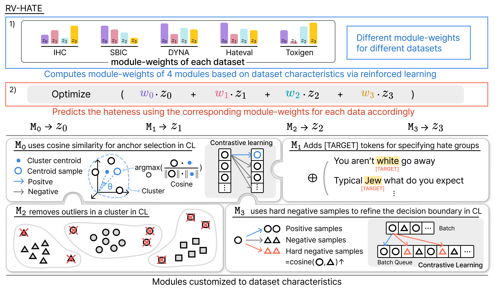

# RV-HATE: Reinforced Multi-Module Voting for Implicit Hate Speech Detection

<p align="center">
  <a href="https://github.com/leeyejin1231/RV-HATE/stargazers">
    
  </a>
  <a href="https://github.com/leeyejin1231/RV-HATE/commits/main">
    
  </a>
  <a href="https://github.com/leeyejin1231/RV-HATE/graphs/contributors">
    
  </a>
</p>

<div align="center">
    <a href="https://arxiv.org/abs/2510.10971"><b>📖 </b>Paper Link</a>
</div><br>

<span style="color: red">❗️***Warning**: this document contains content that may be offensive or upsetting.*</span>

> **RV-HATE**, introduces a reinforcement learning–based multi-module framework that adaptively detects implicit hate speech by modeling dataset-specific linguistic and contextual characteristics.

## 🗳️ About RV-HATE
<p align="center">
  
</p>

**RV-HATE**, a reinforced multi-module voting framework for **implicit hate speech detection**. Unlike prior methods that rely on fixed architectures, RV-HATE dynamically adjusts to dataset-specific linguistic and contextual properties. 

It integrates **four specialized modules**—contextual clustering (base model), target tagging, outlier removal, and hard negative sampling—and employs reinforcement learning to optimize their contributions through an adaptive voting mechanism. 

This design not only enhances detection accuracy across diverse datasets but also provides interpretable insights into how each dataset’s unique features influence hate speech expression, achieving **state-of-the-art performance** in implicit hate speech detection.

## ⚙️ Modules
### M0 - clustering-based Contrastive Learning
- Serves as the base module.
- Uses cosine similarity (instead of Euclidean distance) to better capture semantic relationships in embeddings.

  > **Given Text**: Black is idiot  
  > **Anchor**: White is the best

  👉 Provides strong **contextual understanding** of hate speech
### M1 - Target Tagging
- Identifies explicit hate targets (e.g., nationality, religion, organizations) using NER + GPT-4 tagging.
- Most effective on datasets rich in implicit or target-based hate, like IHC.
  > White is the best → [TARGET] **White** is the best

  👉 Helps the model more **clearly identify which specific group is being targeted** with hate.
### M2 - Outlier Removal
- Detects and removes broken or noisy sentences via Interquartile Range (IQR) analysis within clusters.
- Reduces the negative effect of noisy or incomplete data.
  > **Outlier**: Yasss brownies & ice cream &##128523; htp://t.co/8qLa3JsglG

  👉 Ensures the model maintains a **clear** and **consistent representation space**
### M3 - Hard Negative Sampling
- Collects difficult negative samples (near the decision boundary) using a queue across batches.
- Sharpens class boundaries and improves discrimination of subtle or mislabeled cases.
  > **Given Text**: White is the best Hate  
  > **Hard Negative**: White is like snow non-Hate

  👉 Enhances the ability to **distinguish between similar but subtly different sentences**, thereby improving detection precision


## 📌 Performance of Detecting Implicit Hate Speech
**RV-HATE** outperforms all baselines across five datasets (macro-F1).
|Methods|IHC|SBIC|DYNA|Hateval|Toxigen|Average|
|-------|---|----|----|-------|-------|-------|
| BERT  | 77.70 | 83.80 | 78.80 | 81.11 | 90.06 | 82.29 |
|SharedCon| 78.50 | 84.30 | 79.10 | 80.24 | 91.21 |82.67 |
|LAHN| 78.40 | 83.98 | 79.64 | 80.42 | 90.42 | 82.57 |
|RV-HATE| **79.07** | **84.62** | **81.82** | **83.44** | **93.41** | **84.47** |

**Average Macro-F1**
- RV-HATE: 84.47%
- Best baseline (SharedCon): 82.67% → +1.8% improvement.

**Dataset-wise improvements**
- IHC: 79.07 → highest among all models.
- SBIC: 84.62 → consistent improvement over SharedCon (84.30).
- DYNA: 81.82 → strongest gain (+2.7%p).
- Hateval: 83.44 → +2.33%p over CE baseline.
- Toxigen: 93.41 → +2.2%p over previous SOTA.  

**RV-HATE** achieves state-of-the-art performance and demonstrates robust adaptability to diverse datasets.

## 🛠️ Setup

### Datasets
Dataset file route: `./raw_datasets/{dataset_name}/`  
Dataset split: Train, Vaild, Test (8:1:1)  

We used the `IHC`, `SBIC`, `DYNA`, `Hateval` and `Toxigen` datasets.

### Install requirements
```bash
$ pip install -r requirements.txt
```


##  🚀 Usage

### Train

#### 1. Modify the `shart.sh` file
```sh
python shared_semantics.py \
    --cluster_num 20 \
    --load_dataset toxigen \
    --load_sent_emb_model princeton-nlp/unsup-simcse-bert-base-uncased \
    --module_type m0

python preprocess_dataset.py \
    -m princeton-nlp \
    -d toxigen_c20 \
    -t bert-base-uncased
    -m m0
...
```
- `cluster_num` = number of clusters  
- `laod_dataset` = dataset name  
- `load_sent_emb_model` = sentence imbedding model name  
- `module_type` = module type (`m0` - `m3`)

#### 2. Modify the config file
Modify `train_config.py` file.  
```python
type = "m0"
```
Set the module type `"m0"` - `"m3"`

#### 3. Start train
```bash
$ chmod +x shart.sh 
$ ./start.sh
```

### Evaluation
#### 1. Modify the `eval_config.py` file

```python 
dataset = ["ihc_pure_c20"]                # dataset for evaluation
dataset_name = "ihc_pure"                 # saved model name
...
SEED = 42                                 # random seed
...
time_step = 100000                        # time step
...
```


#### 2. Test start
```bash
$ python ppo_eval.py
```

## Citation
```
@misc{lee2025rvhatereinforcedmultimodulevoting,
      title={RV-HATE: Reinforced Multi-Module Voting for Implicit Hate Speech Detection}, 
      author={Yejin Lee and Hyeseon Ahn and Yo-Sub Han},
      year={2025},
      eprint={2510.10971},
      archivePrefix={arXiv},
      primaryClass={cs.CL},
      url={https://arxiv.org/abs/2510.10971}, 
}
```

---
### Additinoal Information
Our code is based on the code from https://github.com/hsannn/sharedcon.  
Also, hard negative smaple follows the code from https://github.com/Hanyang-HCC-Lab/LAHN.
